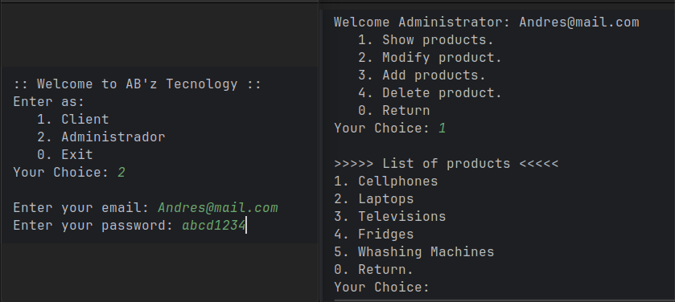

# Simulador Tienda Virtual

### Simulador de Tienda Virtual Desarrollado con Programación Orientada a Objetos

Este simulador de tienda virtual ofrece una experiencia completa tanto para clientes como para administradores. Las principales funciones incluyen:
 
Ingreso de Usuarios:
 
Cliente: Puede visualizar los productos y realizar compras.
 
Administrador: Requiere autenticación para acceder. Una vez autenticado, el administrador puede agregar, modificar o eliminar productos de la tienda.
Este simulador está diseñado para brindar una experiencia intuitiva y eficiente, aprovechando las ventajas de la Programación Orientada a Objetos.
 
    
## Objetivos del proyecto:
1. Poner en practica los conocimientos adquiridos en los cursos que tome sobre
programación orientada a objetos con Java:
    
    - Abstracción.
    - Herencia.
    - Encapsulamiento.
    - Polimorfismo.
    - Clases y Objetos.
    - Clases abstractas e interfaces.
    - Principio de modularidad.
    - Constructores.
    - Variables y métodos estáticos.
    - Sobre escritura de métodos.
    - Getters y Setters.
    - Palabras reservadas de Java.
    - Funcionamiento de la memoria en Java(Stack, Heap).
    - Garbage Collector.
    - Manejo de errores.
    - Estructuras de datos.
    - Entre otros...
       
2. Mejorar mi lógica de programación.

## ¿Como usar el programa?
1. Descarga los archivos en tu equipo.

#### Para ejecutarlo utilizando un IDE:
Abre la carpeta desde tu IDE preferido y corre el programa directamente
desde la clase Main.

### Para ejecutarlo sin utilizar un IDE:
1. Descarga el archivo Shop.jar
2. Ejecuta el .jar de acuerdo a tu SO.
 
Ya puedes hacer uso del programa :).
 
Nota: Recuerda tener instalado JDK 21.0.4 en tu equipo.
